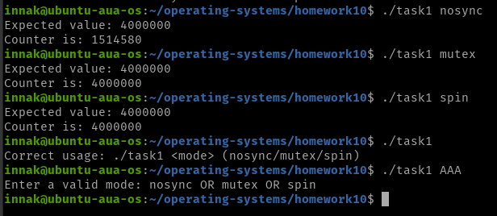
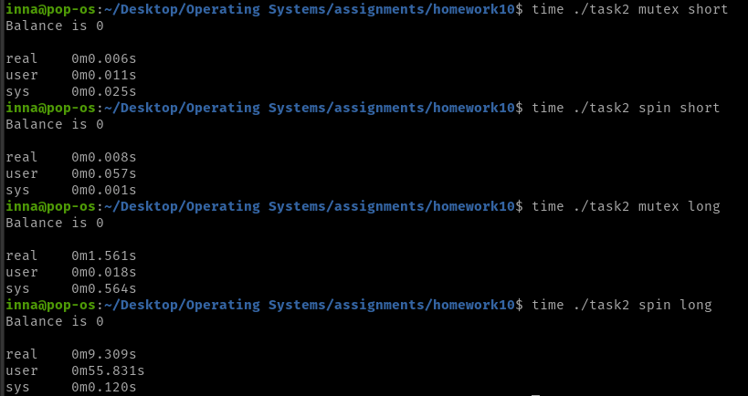

### Task 1
The nosync version gives the wrong answer becasue of the race condition.
Example: let's say that the value of the counter is 100.
More than one thread, let's say 3 of them, read this value simultaneously and increment it to 101, write it back to memory, so instead of incrementing the counter to 103 together, they all increment it to 101. If Read-After-Write, Write-After-Write conditions are not met, that would lead to false results.
Spinlock and mutex solve this problem as thay protect the critical section, and one thread reads the var only after the other writes, AND writes after write. the locks ensure these.

### Task 2
For the short version spinlock is better, as the work is short it is better to wait in a busy loop, rather than sleep until the lock is released. Sleeping and waking up is not worth of the resources spent in such a short-term work.
For the long version with usleep(100) mutex is much better. When the job to be done is long, it is better to use mutex, to sleep until the lock is released rather than do a busy loop-waiting as it takes much resources.

### Task 3
The semaphore itself keeps the track of when the slots are empty/full, so the thread goes to sleep until
 the condition is met. It does not lock the critical section. For locking critical section we still need some locking mechanism, like mutex. Sempahore is for inter-thread (for this task) communication, so that they "know" when they can produce/consume, and when there is no job to do yet, and can go to sleep.

